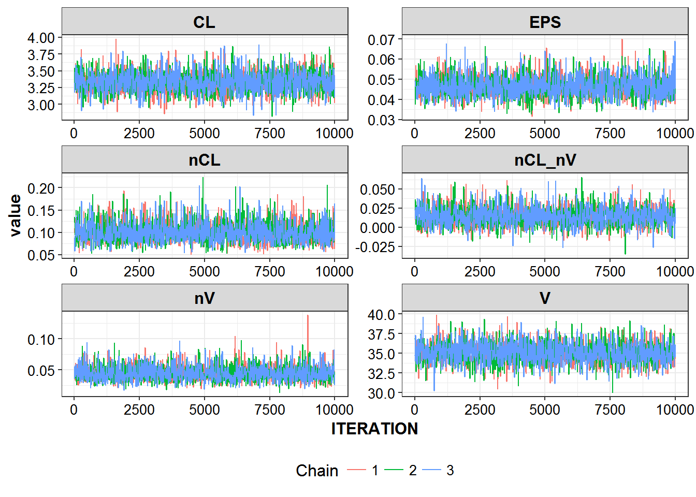

# Bayesian analysis


```r
library(PKPDmisc)
library(data.table)
library(tidyverse)
library(knitr)
library(infuser)
```

Core differences

* Need priors on parameters
* EM algorithms can more robustly handle full block matrices as well as
random effects on less well-defined parameters.

## Priors

Priors in nonmem may be defined in two ways:

1) By distinguishing the thetas/omegas and their priors in `$PRIOR`

* NTHETA=number of Thetas to be estimated
* NETA=number of Etas to be estimated
    * (and to be described by NETAxBETA OMEGA matrix)
* NTHP=number of thetas which have a prior
* NETP=number of Omegas with prior

In our case we have 2 Thetas (TVCL, TVV) and 2 omegas (nCl, nV)

```
$PRIOR NWPRI NTHETA=2 NETA=2, NTHP=2, NETP=2
```

Or the *preferred way* of distinguishing in the block definitions

* $THETA - fixed effects
* $OMEGA - random effects
* $SIGMA - residual error
* $THETAP - theta prior
* $THETAPV - variance of theta prior
* $OMEGAP - omega prior
* $OMEGAPD - degrees of freedom to prior omega matrix

** TODO: fill out explanations of each. **

# Bayesian Problems (and solutions)

Some of the problem areas in bayesian analysis techniques are .....

* autocorrelation
* sensitivity to priors
* ...

## Chains

Technique - a 'master' execution file can be used to generate new paramater values
that can be used for multi-chain runs.

* NSAMPLE - sets number of preturbed parameter estimates, in this case 4
* ISAMPLE - if subsequently estimating, will use the parameters generated from this sample
    * by setting to 0 will not tweak these parameters

```
$EST METHOD=CHAIN FILE=run003chains.chn NSAMPLE=4 ISAMPLE=0 DF=10
```

The larger the DF (degrees of freedom for randomly creating the OMEGAS) the smaller the
difference between newly generated values. Eg, with `DF=10000` almost no difference in values,
whereas DF=5 will have 2x+ differences in values

#### example output comparing output from all chains

** TODO: add more instructions on what all is going on **


```r
set.seed(1234567)
modt <- read_file("../modeling/run006c.modt")
map(1:4, ~ write_file(
    infuse(modt, 
           chain_number = ., 
           seed = round(runif(1, 1000, 100000), 0)), 
    file.path("..", "modeling", paste0("run006c", ., ".mod"))))
#> [[1]]
#> $PROB one cmpt simple mu modeled bayes
#> $SUB ADVAN1 TRANS2
#> $INPUT ID TIME DV CMT EVID AMT RATE
#> $DATA mdata/simple_nocovar_50id_6tp.csv IGNORE=@
#> $ABBR REPLACE THETA(CL, V) = THETA(1 to 2)
#> $ABBR REPLACE ETA(CL, V) = ETA(1 to 2)
#> 
#> $THETAI
#> THETA(1:NTHETA)=LOG(THETAI(1:NTHETA))
#> THETAP(1:NTHETAP)=LOG(THETAPI(1:NTHETAP))
#> $THETAR
#> THETAR(1:NTHETA)=EXP(THETA(1:NTHETA))
#> THETAPR(1:NTHETAP)=EXP(THETAP(1:NTHETAP))
#> 
#> $PRIOR NWPRI 
#> 
#> $PK
#> "USE NMBAYES_INT, ONLY: ITER_REPORT,BAYES_EXTRA_REQUEST,BAYES_EXTRA
#> ; Request extra information for Bayesian analysis.
#> ; An extra call will then be made for accepted samples
#> "BAYES_EXTRA_REQUEST=1
#> 
#> MU_1 = THETA(CL)
#> MU_2 = THETA(V)
#> CL = EXP(MU_1 + ETA(CL))
#> V = EXP(MU_2 + ETA(V))
#> S1 = V
#> 
#> "IF(BAYES_EXTRA==1 .AND. ITER_REPORT>=0 .AND. TIME==0.0) THEN
#> "WRITE(50,98) ITER_REPORT,ID,CL,V
#> "98 FORMAT(I12,1X,F14.0,4(1X,1PG12.5))
#> "ENDIF
#> 
#> $ERROR
#> "USE NMBAYES_INT, ONLY: ITER_REPORT,BAYES_EXTRA_REQUEST,BAYES_EXTRA
#> "BAYES_EXTRA_REQUEST=1
#> IPRED=F
#> Y = IPRED*(1 + ERR(1))  
#> "IF(BAYES_EXTRA==1 .AND. ITER_REPORT>=0 ) THEN
#> "WRITE(51,97) ITER_REPORT,ID,TIME,F
#> "97 FORMAT(I12,1X,F14.0,2(1X,1PG12.5))
#> "ENDIF
#> 
#> $THETA
#> (0.001, 3) ; TVCL
#> (0.001, 34) ; TVV
#> 
#> $OMEGA BLOCK(2)
#> 0.1    ; nCL
#> 0.1  0.1  ; nV
#> 
#> $SIGMA
#> 0.03 ; PROP
#> 
#> ; THETA PRIORS
#> $THETAP (3 FIX) (34 FIX) 
#> 
#> ; THETA (uniformative) PRIORs
#> $THETAPV BLOCK(2)
#> 10000 FIX
#> 0.0 10000 
#> 
#> $OMEGAP BLOCK(2)
#> 0.2 FIX
#> 0 0.2
#> 
#> ; degrees of freedom to prior omega matrix - low dof = highly uninformative
#> $OMEGAPD (2 FIX)
#> 
#> $EST METHOD=CHAIN FILE=..\run006chains.chn NSAMPLE=0 ISAMPLE=1 DF=20
#> $EST METHOD=BAYES INTER NBURN=4000 NITER=10000 PRINT=20 NOPRIOR=0 CTYPE=3 CITER=10 SEED=56664
#> 
#> [[2]]
#> $PROB one cmpt simple mu modeled bayes
#> $SUB ADVAN1 TRANS2
#> $INPUT ID TIME DV CMT EVID AMT RATE
#> $DATA mdata/simple_nocovar_50id_6tp.csv IGNORE=@
#> $ABBR REPLACE THETA(CL, V) = THETA(1 to 2)
#> $ABBR REPLACE ETA(CL, V) = ETA(1 to 2)
#> 
#> $THETAI
#> THETA(1:NTHETA)=LOG(THETAI(1:NTHETA))
#> THETAP(1:NTHETAP)=LOG(THETAPI(1:NTHETAP))
#> $THETAR
#> THETAR(1:NTHETA)=EXP(THETA(1:NTHETA))
#> THETAPR(1:NTHETAP)=EXP(THETAP(1:NTHETAP))
#> 
#> $PRIOR NWPRI 
#> 
#> $PK
#> "USE NMBAYES_INT, ONLY: ITER_REPORT,BAYES_EXTRA_REQUEST,BAYES_EXTRA
#> ; Request extra information for Bayesian analysis.
#> ; An extra call will then be made for accepted samples
#> "BAYES_EXTRA_REQUEST=1
#> 
#> MU_1 = THETA(CL)
#> MU_2 = THETA(V)
#> CL = EXP(MU_1 + ETA(CL))
#> V = EXP(MU_2 + ETA(V))
#> S1 = V
#> 
#> "IF(BAYES_EXTRA==1 .AND. ITER_REPORT>=0 .AND. TIME==0.0) THEN
#> "WRITE(50,98) ITER_REPORT,ID,CL,V
#> "98 FORMAT(I12,1X,F14.0,4(1X,1PG12.5))
#> "ENDIF
#> 
#> $ERROR
#> "USE NMBAYES_INT, ONLY: ITER_REPORT,BAYES_EXTRA_REQUEST,BAYES_EXTRA
#> "BAYES_EXTRA_REQUEST=1
#> IPRED=F
#> Y = IPRED*(1 + ERR(1))  
#> "IF(BAYES_EXTRA==1 .AND. ITER_REPORT>=0 ) THEN
#> "WRITE(51,97) ITER_REPORT,ID,TIME,F
#> "97 FORMAT(I12,1X,F14.0,2(1X,1PG12.5))
#> "ENDIF
#> 
#> $THETA
#> (0.001, 3) ; TVCL
#> (0.001, 34) ; TVV
#> 
#> $OMEGA BLOCK(2)
#> 0.1    ; nCL
#> 0.1  0.1  ; nV
#> 
#> $SIGMA
#> 0.03 ; PROP
#> 
#> ; THETA PRIORS
#> $THETAP (3 FIX) (34 FIX) 
#> 
#> ; THETA (uniformative) PRIORs
#> $THETAPV BLOCK(2)
#> 10000 FIX
#> 0.0 10000 
#> 
#> $OMEGAP BLOCK(2)
#> 0.2 FIX
#> 0 0.2
#> 
#> ; degrees of freedom to prior omega matrix - low dof = highly uninformative
#> $OMEGAPD (2 FIX)
#> 
#> $EST METHOD=CHAIN FILE=..\run006chains.chn NSAMPLE=0 ISAMPLE=2 DF=20
#> $EST METHOD=BAYES INTER NBURN=4000 NITER=10000 PRINT=20 NOPRIOR=0 CTYPE=3 CITER=10 SEED=72923
#> 
#> [[3]]
#> $PROB one cmpt simple mu modeled bayes
#> $SUB ADVAN1 TRANS2
#> $INPUT ID TIME DV CMT EVID AMT RATE
#> $DATA mdata/simple_nocovar_50id_6tp.csv IGNORE=@
#> $ABBR REPLACE THETA(CL, V) = THETA(1 to 2)
#> $ABBR REPLACE ETA(CL, V) = ETA(1 to 2)
#> 
#> $THETAI
#> THETA(1:NTHETA)=LOG(THETAI(1:NTHETA))
#> THETAP(1:NTHETAP)=LOG(THETAPI(1:NTHETAP))
#> $THETAR
#> THETAR(1:NTHETA)=EXP(THETA(1:NTHETA))
#> THETAPR(1:NTHETAP)=EXP(THETAP(1:NTHETAP))
#> 
#> $PRIOR NWPRI 
#> 
#> $PK
#> "USE NMBAYES_INT, ONLY: ITER_REPORT,BAYES_EXTRA_REQUEST,BAYES_EXTRA
#> ; Request extra information for Bayesian analysis.
#> ; An extra call will then be made for accepted samples
#> "BAYES_EXTRA_REQUEST=1
#> 
#> MU_1 = THETA(CL)
#> MU_2 = THETA(V)
#> CL = EXP(MU_1 + ETA(CL))
#> V = EXP(MU_2 + ETA(V))
#> S1 = V
#> 
#> "IF(BAYES_EXTRA==1 .AND. ITER_REPORT>=0 .AND. TIME==0.0) THEN
#> "WRITE(50,98) ITER_REPORT,ID,CL,V
#> "98 FORMAT(I12,1X,F14.0,4(1X,1PG12.5))
#> "ENDIF
#> 
#> $ERROR
#> "USE NMBAYES_INT, ONLY: ITER_REPORT,BAYES_EXTRA_REQUEST,BAYES_EXTRA
#> "BAYES_EXTRA_REQUEST=1
#> IPRED=F
#> Y = IPRED*(1 + ERR(1))  
#> "IF(BAYES_EXTRA==1 .AND. ITER_REPORT>=0 ) THEN
#> "WRITE(51,97) ITER_REPORT,ID,TIME,F
#> "97 FORMAT(I12,1X,F14.0,2(1X,1PG12.5))
#> "ENDIF
#> 
#> $THETA
#> (0.001, 3) ; TVCL
#> (0.001, 34) ; TVV
#> 
#> $OMEGA BLOCK(2)
#> 0.1    ; nCL
#> 0.1  0.1  ; nV
#> 
#> $SIGMA
#> 0.03 ; PROP
#> 
#> ; THETA PRIORS
#> $THETAP (3 FIX) (34 FIX) 
#> 
#> ; THETA (uniformative) PRIORs
#> $THETAPV BLOCK(2)
#> 10000 FIX
#> 0.0 10000 
#> 
#> $OMEGAP BLOCK(2)
#> 0.2 FIX
#> 0 0.2
#> 
#> ; degrees of freedom to prior omega matrix - low dof = highly uninformative
#> $OMEGAPD (2 FIX)
#> 
#> $EST METHOD=CHAIN FILE=..\run006chains.chn NSAMPLE=0 ISAMPLE=3 DF=20
#> $EST METHOD=BAYES INTER NBURN=4000 NITER=10000 PRINT=20 NOPRIOR=0 CTYPE=3 CITER=10 SEED=91610
#> 
#> [[4]]
#> $PROB one cmpt simple mu modeled bayes
#> $SUB ADVAN1 TRANS2
#> $INPUT ID TIME DV CMT EVID AMT RATE
#> $DATA mdata/simple_nocovar_50id_6tp.csv IGNORE=@
#> $ABBR REPLACE THETA(CL, V) = THETA(1 to 2)
#> $ABBR REPLACE ETA(CL, V) = ETA(1 to 2)
#> 
#> $THETAI
#> THETA(1:NTHETA)=LOG(THETAI(1:NTHETA))
#> THETAP(1:NTHETAP)=LOG(THETAPI(1:NTHETAP))
#> $THETAR
#> THETAR(1:NTHETA)=EXP(THETA(1:NTHETA))
#> THETAPR(1:NTHETAP)=EXP(THETAP(1:NTHETAP))
#> 
#> $PRIOR NWPRI 
#> 
#> $PK
#> "USE NMBAYES_INT, ONLY: ITER_REPORT,BAYES_EXTRA_REQUEST,BAYES_EXTRA
#> ; Request extra information for Bayesian analysis.
#> ; An extra call will then be made for accepted samples
#> "BAYES_EXTRA_REQUEST=1
#> 
#> MU_1 = THETA(CL)
#> MU_2 = THETA(V)
#> CL = EXP(MU_1 + ETA(CL))
#> V = EXP(MU_2 + ETA(V))
#> S1 = V
#> 
#> "IF(BAYES_EXTRA==1 .AND. ITER_REPORT>=0 .AND. TIME==0.0) THEN
#> "WRITE(50,98) ITER_REPORT,ID,CL,V
#> "98 FORMAT(I12,1X,F14.0,4(1X,1PG12.5))
#> "ENDIF
#> 
#> $ERROR
#> "USE NMBAYES_INT, ONLY: ITER_REPORT,BAYES_EXTRA_REQUEST,BAYES_EXTRA
#> "BAYES_EXTRA_REQUEST=1
#> IPRED=F
#> Y = IPRED*(1 + ERR(1))  
#> "IF(BAYES_EXTRA==1 .AND. ITER_REPORT>=0 ) THEN
#> "WRITE(51,97) ITER_REPORT,ID,TIME,F
#> "97 FORMAT(I12,1X,F14.0,2(1X,1PG12.5))
#> "ENDIF
#> 
#> $THETA
#> (0.001, 3) ; TVCL
#> (0.001, 34) ; TVV
#> 
#> $OMEGA BLOCK(2)
#> 0.1    ; nCL
#> 0.1  0.1  ; nV
#> 
#> $SIGMA
#> 0.03 ; PROP
#> 
#> ; THETA PRIORS
#> $THETAP (3 FIX) (34 FIX) 
#> 
#> ; THETA (uniformative) PRIORs
#> $THETAPV BLOCK(2)
#> 10000 FIX
#> 0.0 10000 
#> 
#> $OMEGAP BLOCK(2)
#> 0.2 FIX
#> 0 0.2
#> 
#> ; degrees of freedom to prior omega matrix - low dof = highly uninformative
#> $OMEGAPD (2 FIX)
#> 
#> $EST METHOD=CHAIN FILE=..\run006chains.chn NSAMPLE=0 ISAMPLE=4 DF=20
#> $EST METHOD=BAYES INTER NBURN=4000 NITER=10000 PRINT=20 NOPRIOR=0 CTYPE=3 CITER=10 SEED=3940
```


```r
r6c1 <- fread("../modeling/run006c1.ext", skip = 1) %>% mutate(chain = 1)
r6c2 <- fread("../modeling/run006c2.ext", skip = 1) %>% mutate(chain = 2)
r6c3 <- fread("../modeling/run006c3.ext", skip = 1) %>% mutate(chain = 3)
r6c4 <- fread("../modeling/run006c4.ext", skip = 1) %>% mutate(chain = 4)
```


```r
r6_chains <- bind_rows(r6c1, r6c2, r6c3) %>% 
    filter(ITERATION > 0) %>%
    rename(CL = THETA1,
           V = THETA2,
           EPS = `SIGMA(1,1)`,
           nCL = `OMEGA(1,1)`,
           nV = `OMEGA(2,2)`,
           nCL_nV = `OMEGA(2,1)`)
```


```r
kable(head(r6_chains))
```


 ITERATION     CL      V     EPS     nCL   nCL_nV      nV   MCMCOBJ   chain
----------  -----  -----  ------  ------  -------  ------  --------  ------
         1   3.08   35.7   0.044   0.121    0.025   0.054       463       1
         2   2.96   35.4   0.042   0.140    0.010   0.044       465       1
         3   3.41   32.8   0.044   0.116    0.030   0.044       484       1
         4   3.33   35.4   0.043   0.150    0.026   0.049       515       1
         5   3.35   35.2   0.053   0.162    0.006   0.044       495       1
         6   3.35   35.2   0.049   0.099    0.009   0.037       467       1

```r
thin_by <- function(df, .mod) {
    df %>% filter(ITERATION %% .mod == 0)
}
```


```r
r6_chains %>% select(ITERATION:nV, chain) %>%
    thin_by(10) %>%
    gather(param, value, CL:nV) %>%
    ggplot(aes(x = ITERATION, y = value, color = factor(chain)), alpha = 0.6) +
    geom_line() + facet_wrap(~param, ncol = 2, scales = "free") +
    theme_bw() +
    base_theme() +
    scale_color_discrete(name = "Chain") + 
    theme(legend.position = "bottom") 
```




```r
session_details <- devtools::session_info()
session_details$platform
#>  setting  value                       
#>  version  R version 3.3.2 (2016-10-31)
#>  system   x86_64, mingw32             
#>  ui       RTerm                       
#>  language (EN)                        
#>  collate  English_United States.1252  
#>  tz       America/New_York            
#>  date     2016-12-12
knitr::kable(session_details$packages)
```


package     *    version   date         source         
----------  ---  --------  -----------  ---------------
backports        1.0.4     2016-10-24   CRAN (R 3.3.2) 
bookdown         0.2       2016-11-12   CRAN (R 3.3.2) 
devtools         1.12.0    2016-06-24   CRAN (R 3.3.2) 
digest           0.6.10    2016-08-02   CRAN (R 3.3.2) 
evaluate         0.10      2016-10-11   CRAN (R 3.3.2) 
htmltools        0.3.5     2016-03-21   CRAN (R 3.3.2) 
httpuv           1.3.3     2015-08-04   CRAN (R 3.3.2) 
knitr            1.15      2016-11-09   CRAN (R 3.3.2) 
magrittr         1.5       2014-11-22   CRAN (R 3.3.2) 
memoise          1.0.0     2016-01-29   CRAN (R 3.3.2) 
mime             0.5       2016-07-07   CRAN (R 3.3.2) 
miniUI           0.1.1     2016-01-15   CRAN (R 3.3.2) 
R6               2.2.0     2016-10-05   CRAN (R 3.3.2) 
Rcpp             0.12.8    2016-11-17   CRAN (R 3.3.2) 
rmarkdown        1.2       2016-11-21   CRAN (R 3.3.2) 
rprojroot        1.1       2016-10-29   CRAN (R 3.3.2) 
shiny            0.14.2    2016-11-01   CRAN (R 3.3.2) 
stringi          1.1.2     2016-10-01   CRAN (R 3.3.2) 
stringr          1.1.0     2016-08-19   CRAN (R 3.3.2) 
withr            1.0.2     2016-06-20   CRAN (R 3.3.2) 
xtable           1.8-2     2016-02-05   CRAN (R 3.3.2) 
yaml             2.1.13    2014-06-12   CRAN (R 3.3.2) 
