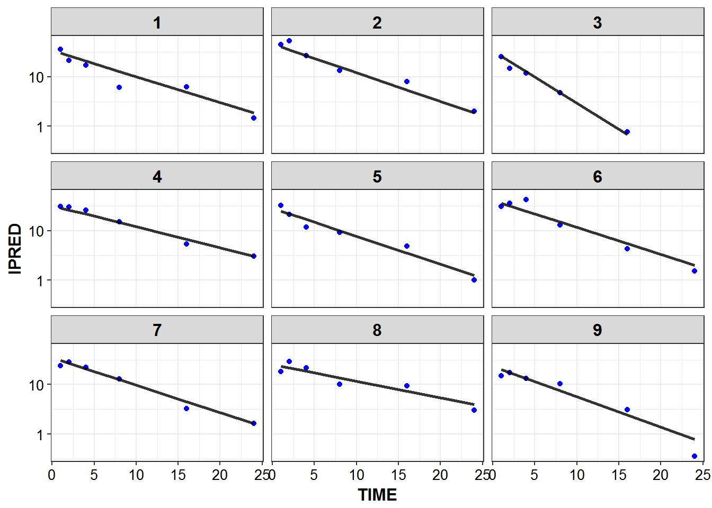
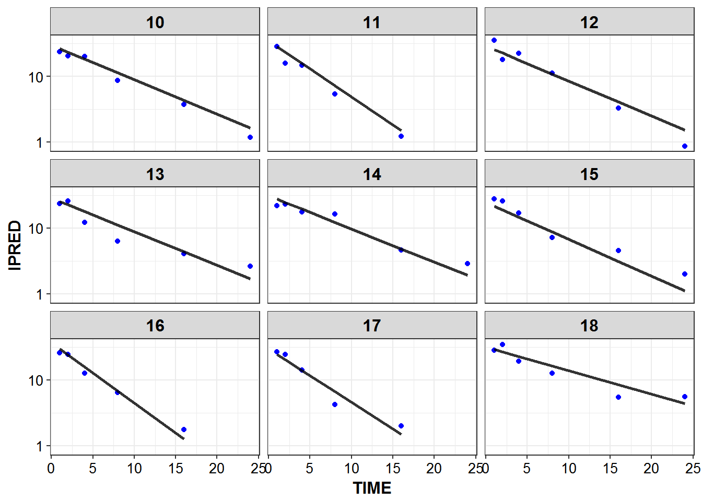
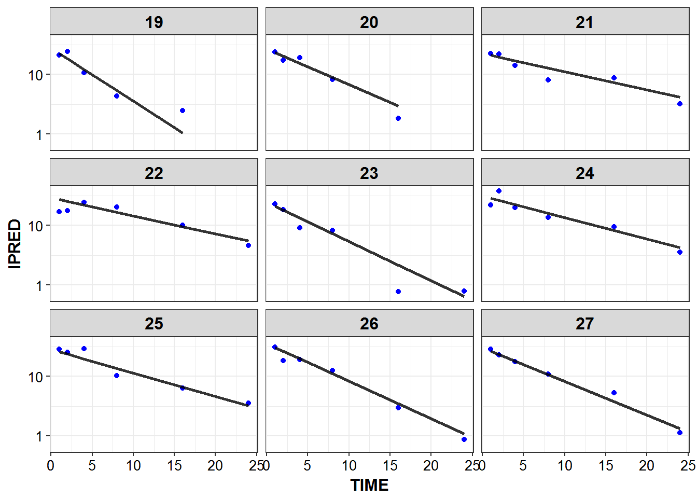
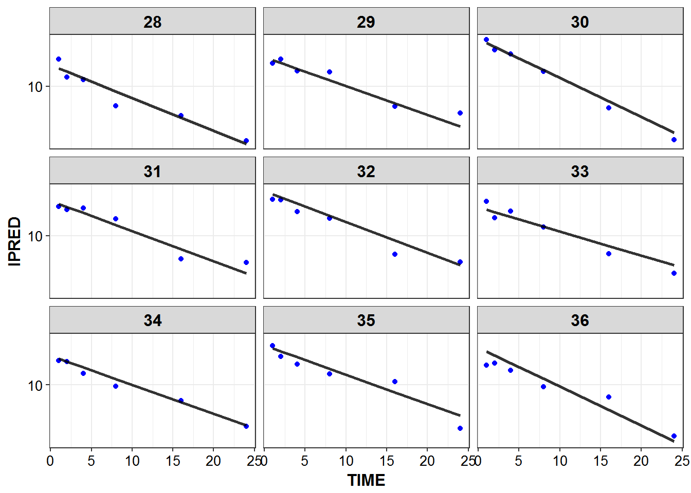
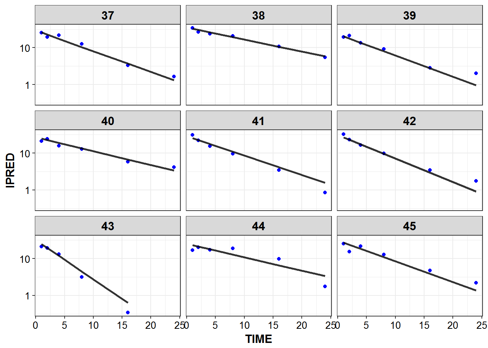
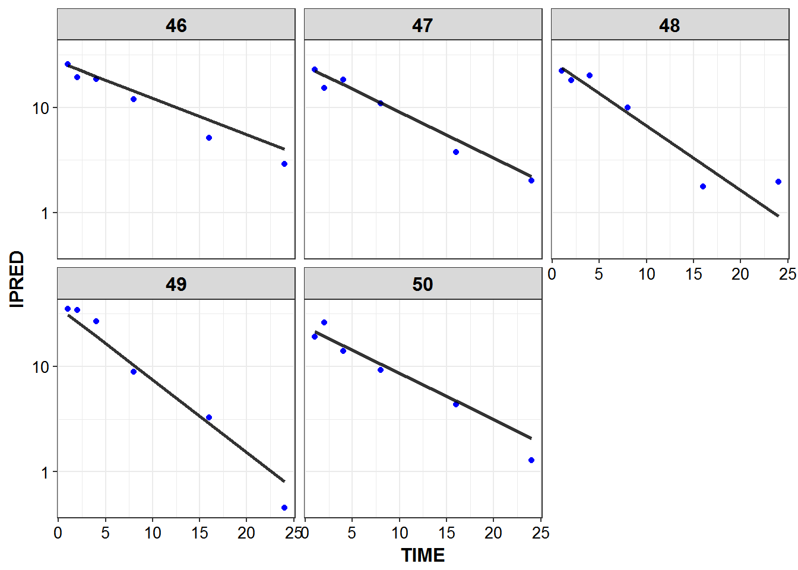

# Dataset Creation


```r
library(knitr)
library(PKPDmisc)
library(tidyverse)
library(mrgsolve)
```


```r
source("../scripts/model_details.R")
```


```r
models <- source("../models/models.R")$value
#> model dir set to C:/Users/devin/Documents/Repos/simplest_bayes/models
#> cache location set to C:\Users\devin\Documents\Repos\simplest_bayes\models\.modelcache
#> Loading model from cache.
```


## Generate data for mrgsolve

start with a baseline of having 50 individuals worth of data, can scale to 
different amounts of individuals later


```r
NIDS <- 50
```


```r
demogs <-  data_frame(ID = 1:NIDS)
```


```r
for_dosing <- demogs %>% 
                  mutate(
                      CMT = 1, 
                      EVID = 1,
                      TIME = 0,
                      AMT = 1000,
                      RATE = 1000
                  ) 
```


```r
one_cmt_iv <- models$use("one_cmt_iv")
```


## Model Details


```r
mrgsolve::see(one_cmt_iv)
#> 
#> Model file:  one_cmt_iv.cpp 
#>  [PARAM] @annotated
#>  CL  : 4   : Clearance (L/hr)
#>  V   : 35  : Volume (L) 
#>  
#>  
#>  [CMT] @annotated
#>  CENT : Central compartment (mg)
#>  
#>  [PKMODEL]
#>  ncmt=1, trans=11
#>  
#>  [MAIN]
#>  double CLi = CL*exp(nCL);
#>  double Vi = V*exp(nV);
#>  
#>    
#>  [OMEGA] @annotated @correlation @block
#>  nCL : 0.1     : Random effect on CL
#>  nV  : 0.4 0.04 : Random effect on V
#>      
#>  [SIGMA] @annotated
#>  PROP : 0.04 : Proportional error
#>  // so don't get into issues with estimating via multiplicative error only
#>  ADD  : 0.5 : Additive residual error
#>  
#>  [TABLE]
#>  double IPRED = CENT/Vi;
#>  double DV = CENT/Vi*(1+PROP) + ADD;
#>  
#>  [CAPTURE] @annotated
#>  DV    : plasma concentration (mg/L)
#>  IPRED : Individual predicted plasma concentration (mg/L)
#>  CLi   : Individual Clearance (L/hr)
#>  Vi    : Individual Volume (L)
```


```r
one_cmt_iv %>% 
    model_details %>% 
    filter(block != "CAPTURE") %>%
    kable()
```


block   name   descr                     unit   options    value
------  -----  ------------------------  -----  --------  ------
PARAM   CL     Clearance                 L/hr   .           4.00
PARAM   V      Volume                    L      .          35.00
CMT     CENT   Central compartment       mg     .           0.00
OMEGA   nCL    Random effect on CL       .      .           0.10
OMEGA   nV     Random effect on V        .      .           0.04
SIGMA   PROP   Proportional error        .      .           0.04
SIGMA   ADD    Additive residual error   .      .           0.50


```r
simulated_data <- one_cmt_iv %>% 
    data_set(for_dosing) %>%
    mrgsim(end = 24, delta = 0.25) %>% as_data_frame
```

## Predicted Profiles


```r
simulated_data %>% 
    filter(IPRED > 0.1) %>%
    ggplot(aes(x = TIME, y = IPRED, group = ID)) +
    geom_line(size = 1.05, alpha = 0.8) + theme_bw() +
    base_theme() + scale_y_log10()
```


## Real world sampling and LLOQ


```r

sample_times <- c(1, 2, 4, 8, 16, 24)
LLOQ <- 0.1
sampled_data <- simulated_data %>% 
    filter(TIME %in% sample_times, DV > LLOQ) 
```

Show which, if any, timepoints have bql values and determine percent bql


```r
sampled_data %>%
    count(TIME) %>% 
    mutate(baseline = first(n),
           perc_bql = 100 - n/baseline*100) %>%
    filter(perc_bql > 0) %>% 
    select(TIME, perc_bql) %>% kable()
```


 TIME   perc_bql
-----  ---------
   24         14

## IPRED and DV vs TIME for all individuals at sampled times


```r
list_plots <- sampled_data %>%
    mutate(PNUM = ids_per_plot(ID)) %>%
    split(.$PNUM) %>%
    map(~ 
    ggplot(., aes(x = TIME, y = IPRED, group = ID)) +
    geom_point(aes(y = DV), color = "blue") + 
    geom_line(size = 1.05, alpha = 0.8) + theme_bw() +
    base_theme() + facet_wrap(~ID) +
        scale_y_log10()
    )

print_plots(list_plots)
```















```
#> [[1]]
#> NULL
#> 
#> [[2]]
#> NULL
#> 
#> [[3]]
#> NULL
#> 
#> [[4]]
#> NULL
#> 
#> [[5]]
#> NULL
#> 
#> [[6]]
#> NULL
```


```r
devtools::session_info()
#> Session info --------------------------------------------------------------
#>  setting  value                       
#>  version  R version 3.3.2 (2016-10-31)
#>  system   x86_64, mingw32             
#>  ui       RTerm                       
#>  language (EN)                        
#>  collate  English_United States.1252  
#>  tz       America/New_York            
#>  date     2016-12-06
#> Packages ------------------------------------------------------------------
#>  package       * version     date      
#>  assertthat      0.1         2013-12-06
#>  backports       1.0.4       2016-10-24
#>  bookdown        0.2         2016-11-12
#>  codetools       0.2-15      2016-10-05
#>  colorspace      1.2-7       2016-10-11
#>  DBI             0.5-1       2016-09-10
#>  devtools        1.12.0      2016-06-24
#>  digest          0.6.10      2016-08-02
#>  dplyr         * 0.5.0       2016-06-24
#>  evaluate        0.10        2016-10-11
#>  ggplot2       * 2.1.0.9001  2016-11-07
#>  gtable          0.2.0       2016-02-26
#>  highr           0.6         2016-05-09
#>  htmltools       0.3.5       2016-03-21
#>  httpuv          1.3.3       2015-08-04
#>  knitr         * 1.15        2016-11-09
#>  labeling        0.3         2014-08-23
#>  lazyeval        0.2.0       2016-06-12
#>  magrittr        1.5         2014-11-22
#>  memoise         1.0.0       2016-01-29
#>  mime            0.5         2016-07-07
#>  miniUI          0.1.1       2016-01-15
#>  mrgsolve      * 0.7.6.9029  2016-12-06
#>  munsell         0.4.3       2016-02-13
#>  overseer      * 0.0.1       2016-12-06
#>  PKPDmisc      * 0.4.4.9000  2016-11-02
#>  plyr            1.8.4       2016-06-08
#>  purrr         * 0.2.2       2016-06-18
#>  R6              2.2.0       2016-10-05
#>  Rcpp            0.12.8      2016-11-17
#>  RcppArmadillo   0.7.500.0.0 2016-10-22
#>  readr         * 1.0.0       2016-08-03
#>  rmarkdown       1.2         2016-11-21
#>  rprojroot       1.1         2016-10-29
#>  scales          0.4.0.9003  2016-11-07
#>  shiny           0.14.2      2016-11-01
#>  stringi         1.1.2       2016-10-01
#>  stringr         1.1.0       2016-08-19
#>  tibble        * 1.2         2016-08-26
#>  tidyr         * 0.6.0       2016-08-12
#>  tidyverse     * 1.0.0       2016-09-09
#>  withr           1.0.2       2016-06-20
#>  xtable          1.8-2       2016-02-05
#>  yaml            2.1.13      2014-06-12
#>  source                                       
#>  CRAN (R 3.3.2)                               
#>  CRAN (R 3.3.2)                               
#>  CRAN (R 3.3.2)                               
#>  CRAN (R 3.3.2)                               
#>  CRAN (R 3.3.2)                               
#>  CRAN (R 3.3.2)                               
#>  CRAN (R 3.3.2)                               
#>  CRAN (R 3.3.2)                               
#>  CRAN (R 3.3.2)                               
#>  CRAN (R 3.3.2)                               
#>  Github (hadley/ggplot2@70c3d69)              
#>  CRAN (R 3.3.2)                               
#>  CRAN (R 3.3.2)                               
#>  CRAN (R 3.3.2)                               
#>  CRAN (R 3.3.2)                               
#>  CRAN (R 3.3.2)                               
#>  CRAN (R 3.3.2)                               
#>  CRAN (R 3.3.2)                               
#>  CRAN (R 3.3.2)                               
#>  CRAN (R 3.3.2)                               
#>  CRAN (R 3.3.2)                               
#>  CRAN (R 3.3.2)                               
#>  Github (metrumresearchgroup/mrgsolve@d92f31a)
#>  CRAN (R 3.3.2)                               
#>  local                                        
#>  Github (dpastoor/PKPDmisc@beae2a6)           
#>  CRAN (R 3.3.2)                               
#>  CRAN (R 3.3.2)                               
#>  CRAN (R 3.3.2)                               
#>  CRAN (R 3.3.2)                               
#>  CRAN (R 3.3.2)                               
#>  CRAN (R 3.3.2)                               
#>  CRAN (R 3.3.2)                               
#>  CRAN (R 3.3.2)                               
#>  Github (hadley/scales@d58d83a)               
#>  CRAN (R 3.3.2)                               
#>  CRAN (R 3.3.2)                               
#>  CRAN (R 3.3.2)                               
#>  CRAN (R 3.3.2)                               
#>  CRAN (R 3.3.2)                               
#>  CRAN (R 3.3.2)                               
#>  CRAN (R 3.3.2)                               
#>  CRAN (R 3.3.2)                               
#>  CRAN (R 3.3.2)
```
