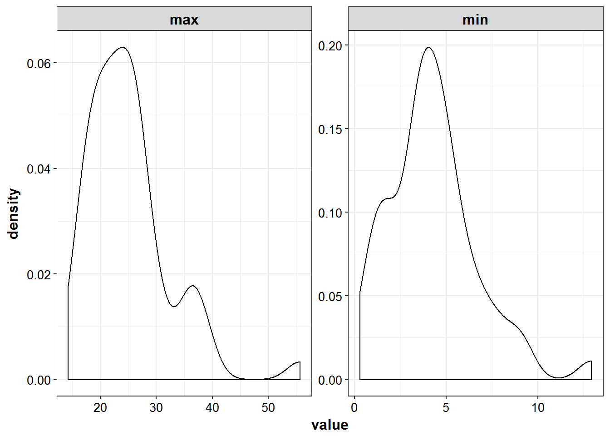

# Dataset Creation


```r
library(knitr)
library(PKPDmisc)
library(tidyverse)
library(mrgsolve) 
```


```r
source("../scripts/model_details.R")
```


```r
models <- source("../models/models.R")$value
#> model dir set to C:/Users/devin/Documents/Repos/simplest_bayes/models
#> cache location set to C:\Users\devin\Documents\Repos\simplest_bayes\models\.modelcache
#> Loading model from cache.
```


## Generate data for mrgsolve

start with a baseline of having 50 individuals worth of data, can scale to 
different amounts of individuals later


```r
NIDS <- 50
```


```r
demogs <-  data_frame(ID = 1:NIDS)
```


```r
for_dosing <- demogs %>% 
                  mutate(
                      CMT = 1, 
                      EVID = 1,
                      TIME = 0,
                      AMT = 1000,
                      RATE = 1000
                  ) 
```


```r
one_cmt_iv <- models$use("one_cmt_iv")
```


## Model Details


```r
mrgsolve::see(one_cmt_iv)
#> 
#> Model file:  one_cmt_iv.cpp 
#>  [PARAM] @annotated
#>  CL  : 3   : Clearance (L/hr)
#>  V   : 35  : Volume (L) 
#>  
#>  
#>  [CMT] @annotated
#>  CENT : Central compartment (mg)
#>  
#>  [PKMODEL]
#>  ncmt=1, trans=11
#>  
#>  [MAIN]
#>  double CLi = CL*exp(nCL);
#>  double Vi = V*exp(nV);
#>  
#>    
#>  [OMEGA] @annotated @correlation @block
#>  nCL : 0.1     : Random effect on CL
#>  nV  : 0.4 0.04 : Random effect on V
#>      
#>  [SIGMA] @annotated
#>  PROP : 0.04 : Proportional error
#>  // so don't get into issues with estimating via multiplicative error only
#>  ADD  : 0.1 : Additive residual error
#>  
#>  [TABLE]
#>  double IPRED = CENT/Vi;
#>  double DV = CENT/Vi*(1+PROP) + ADD;
#>  
#>  [CAPTURE] @annotated
#>  DV    : plasma concentration (mg/L)
#>  IPRED : Individual predicted plasma concentration (mg/L)
#>  CLi   : Individual Clearance (L/hr)
#>  Vi    : Individual Volume (L)
```


```r
one_cmt_iv %>% 
    model_details %>% 
    filter(block != "CAPTURE") %>%
    kable()
```


block   name   descr                     unit   options    value
------  -----  ------------------------  -----  --------  ------
PARAM   CL     Clearance                 L/hr   .           3.00
PARAM   V      Volume                    L      .          35.00
CMT     CENT   Central compartment       mg     .           0.00
OMEGA   nCL    Random effect on CL       .      .           0.10
OMEGA   nV     Random effect on V        .      .           0.04
SIGMA   PROP   Proportional error        .      .           0.04
SIGMA   ADD    Additive residual error   .      .           0.10


```r
simulated_data <- one_cmt_iv %>% 
    data_set(for_dosing) %>%
    mrgsim(end = 24, delta = 0.25) %>% as_data_frame
```

## Distribution of peak and trough values

* 'peak' defined as 1 hr post infusion and trough 1 hour prior to when next dose would begin

```r
simulated_data %>% 
    filter(TIME %in% c(2, 23)) %>% 
    mutate(DV = ifelse(DV < 0, 0, DV)) %>%
    select(ID, DV) %>%
    group_by(ID) %>%
    summarize_all(funs(min, max)) %>%
    gather(sample, value, -ID) %>%
    ggplot(aes(x = value)) + 
    geom_density() +
    facet_wrap(~sample, scales = "free") +
    theme_bw() +
    base_theme()
```



## Predicted Profiles


```r
simulated_data %>% 
    filter(IPRED > 0.1) %>%
    ggplot(aes(x = TIME, y = IPRED, group = ID)) +
    geom_line(size = 1.05, alpha = 0.8) + theme_bw() +
    base_theme() + scale_y_log10()
```


## Real world sampling and LLOQ


```r

sample_times <- c(2, 4, 8, 16, 24)
LLOQ <- 0.1
sampled_data <- simulated_data %>% 
    filter(TIME %in% sample_times, DV > LLOQ) 
```

Show which, if any, timepoints have bql values and determine percent bql


```r
sampled_data %>%
    count(TIME) %>% 
    mutate(baseline = first(n),
           perc_bql = 100 - n/baseline*100) %>%
    filter(perc_bql > 0) %>% 
    select(TIME, perc_bql) %>% knitr::kable()
```


 TIME   perc_bql
-----  ---------

## IPRED and DV vs TIME for all individuals at sampled times


```r
list_plots <- sampled_data %>%
    mutate(PNUM = ids_per_plot(ID)) %>%
    split(.$PNUM) %>%
    map(~ 
    ggplot(., aes(x = TIME, y = IPRED, group = ID)) +
    geom_point(aes(y = DV), color = "blue") + 
    geom_line(size = 1.05, alpha = 0.8) + theme_bw() +
    base_theme() + facet_wrap(~ID) +
        scale_y_log10()
    )

print_plots(list_plots)
```















```
#> [[1]]
#> NULL
#> 
#> [[2]]
#> NULL
#> 
#> [[3]]
#> NULL
#> 
#> [[4]]
#> NULL
#> 
#> [[5]]
#> NULL
#> 
#> [[6]]
#> NULL
```

## Prepare for nonmem


```r
nm_dat <- sampled_data %>% select(ID, TIME, DV) %>%
    mutate(CMT = 1,
           EVID = 0
           ) %>%
    bind_rows(for_dosing) %>%
        arrange(ID, TIME, desc(EVID))
```


```r
kable(head(nm_dat))
```


 ID   TIME      DV   CMT   EVID    AMT   RATE
---  -----  ------  ----  -----  -----  -----
  1      0      NA     1      1   1000   1000
  1      2   22.40     1      0     NA     NA
  1      4   18.59     1      0     NA     NA
  1      8    7.88     1      0     NA     NA
  1     16   10.20     1      0     NA     NA
  1     24    2.70     1      0     NA     NA


```r
write_nonmem(nm_dat, "../modeling/mdata/simple_nocovar_50id_6tp.csv")
```


```r
session_details <- devtools::session_info()
session_details$platform
#>  setting  value                       
#>  version  R version 3.3.2 (2016-10-31)
#>  system   x86_64, mingw32             
#>  ui       RTerm                       
#>  language (EN)                        
#>  collate  English_United States.1252  
#>  tz       America/New_York            
#>  date     2016-12-12
knitr::kable(session_details$packages)
```


package     *    version   date         source         
----------  ---  --------  -----------  ---------------
backports        1.0.4     2016-10-24   CRAN (R 3.3.2) 
bookdown         0.2       2016-11-12   CRAN (R 3.3.2) 
devtools         1.12.0    2016-06-24   CRAN (R 3.3.2) 
digest           0.6.10    2016-08-02   CRAN (R 3.3.2) 
evaluate         0.10      2016-10-11   CRAN (R 3.3.2) 
htmltools        0.3.5     2016-03-21   CRAN (R 3.3.2) 
httpuv           1.3.3     2015-08-04   CRAN (R 3.3.2) 
knitr            1.15      2016-11-09   CRAN (R 3.3.2) 
magrittr         1.5       2014-11-22   CRAN (R 3.3.2) 
memoise          1.0.0     2016-01-29   CRAN (R 3.3.2) 
mime             0.5       2016-07-07   CRAN (R 3.3.2) 
miniUI           0.1.1     2016-01-15   CRAN (R 3.3.2) 
R6               2.2.0     2016-10-05   CRAN (R 3.3.2) 
Rcpp             0.12.8    2016-11-17   CRAN (R 3.3.2) 
rmarkdown        1.2       2016-11-21   CRAN (R 3.3.2) 
rprojroot        1.1       2016-10-29   CRAN (R 3.3.2) 
shiny            0.14.2    2016-11-01   CRAN (R 3.3.2) 
stringi          1.1.2     2016-10-01   CRAN (R 3.3.2) 
stringr          1.1.0     2016-08-19   CRAN (R 3.3.2) 
withr            1.0.2     2016-06-20   CRAN (R 3.3.2) 
xtable           1.8-2     2016-02-05   CRAN (R 3.3.2) 
yaml             2.1.13    2014-06-12   CRAN (R 3.3.2) 
