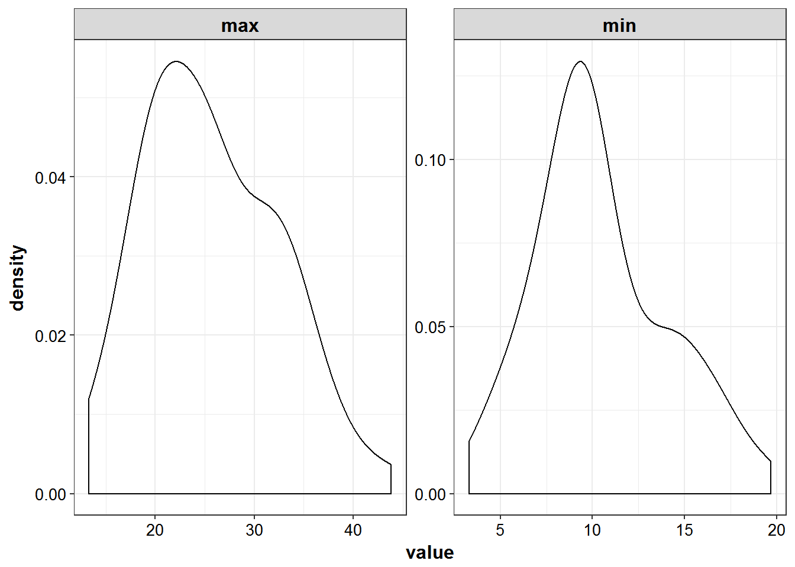
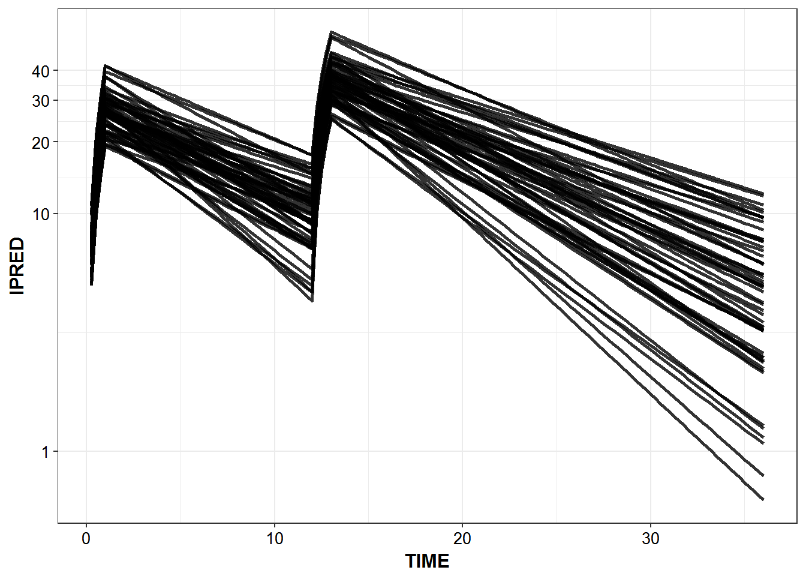
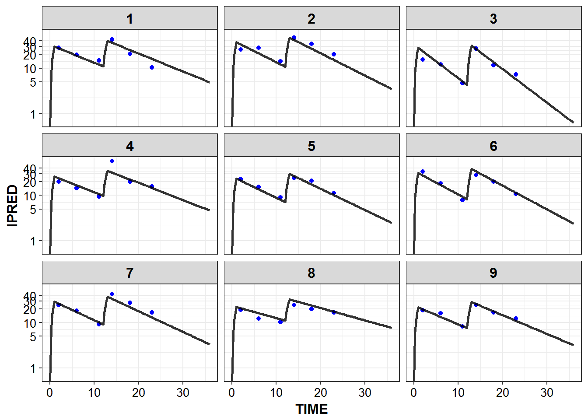
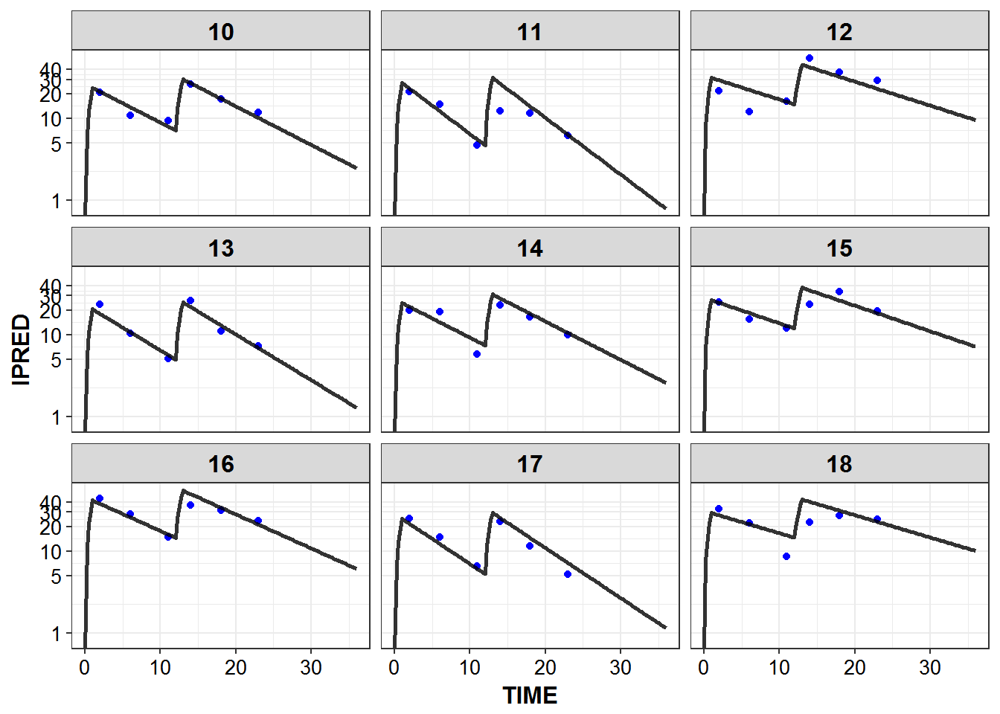
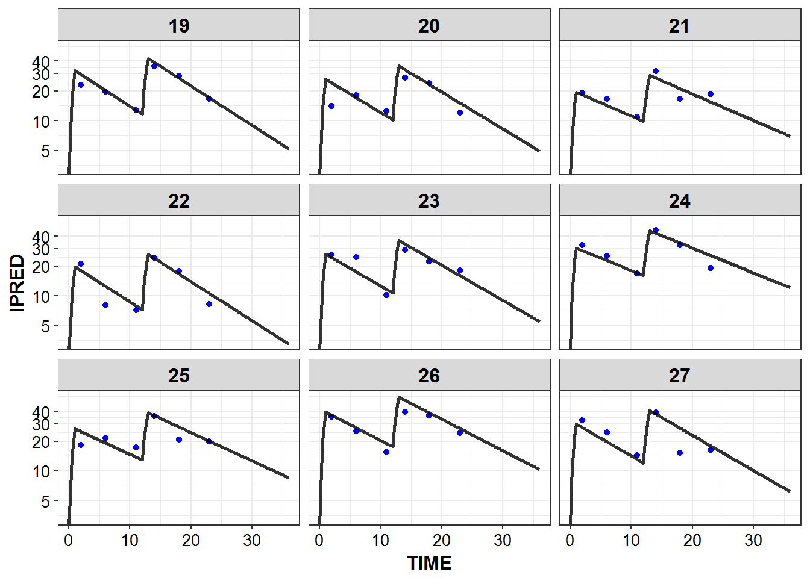
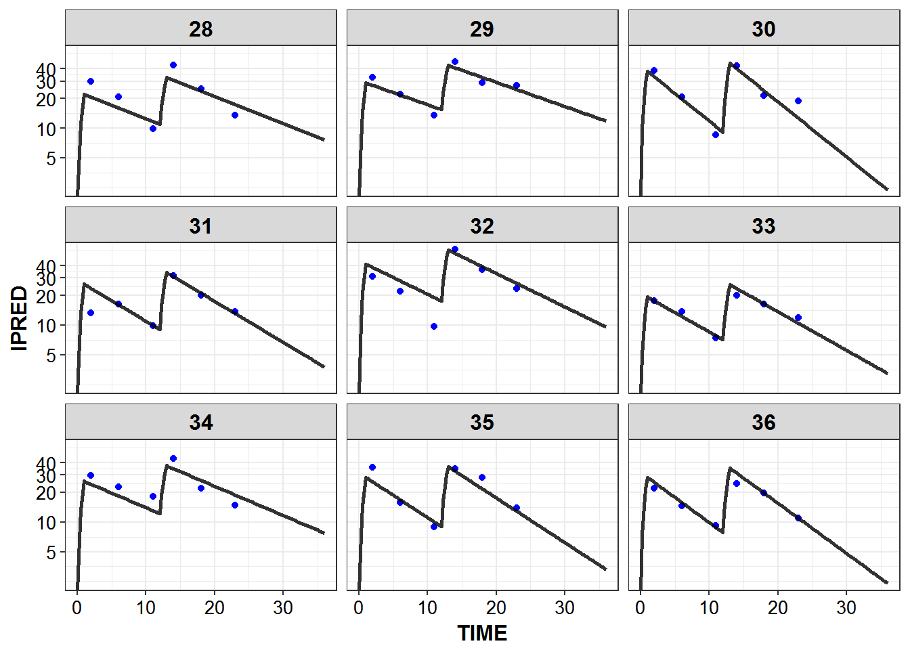
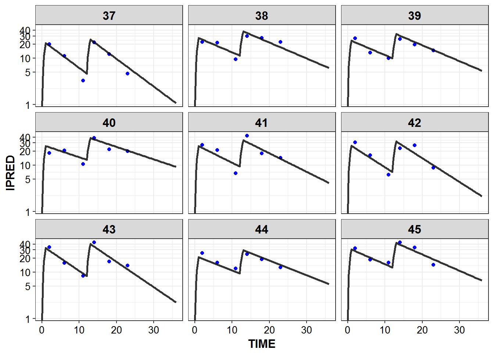
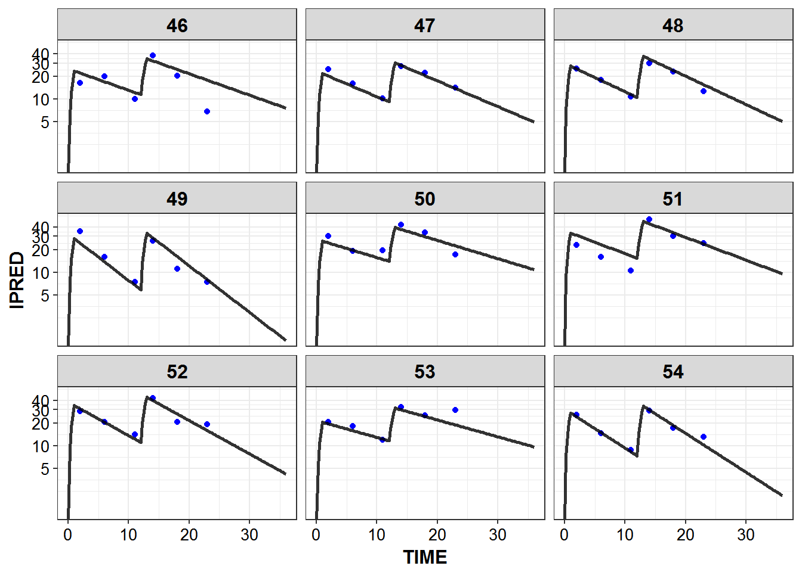
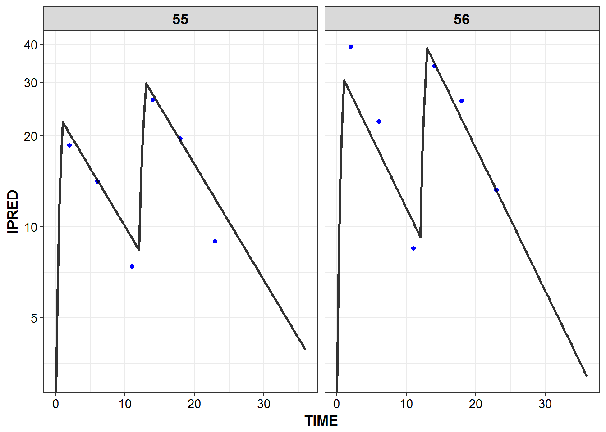

# Dataset Creation


```r
library(knitr)
library(PKPDmisc)
library(tidyverse)
library(mrgsolve) 
library(infuser)
```


```r
source("../scripts/model_details.R")
```


```r
models <- source("../models/models.R")$value
#> model dir set to C:/Users/devin/Documents/Repos/simplest_bayes/models
#> cache location set to C:\Users\devin\Documents\Repos\simplest_bayes\models\.modelcache
#> Loading model from cache.
```


## Generate data for mrgsolve

start with a baseline of having 50 individuals worth of data, can scale to 
different amounts of individuals later


```r
NIDS <- 56
```


```r
demogs <-  data_frame(ID = 1:NIDS)
```


```r
for_dosing <- demogs %>% 
                  mutate(
                      CMT = 1, 
                      EVID = 1,
                      TIME = 0,
                      AMT = 1000,
                      RATE = 1000,
                      ADDL = 1,
                      II = 12,
                      OBSNUM = 0
                  ) 
```


```r
one_cmt_iv <- models$use("one_cmt_iv")
```


## Model Details


```r
mrgsolve::see(one_cmt_iv)
#> 
#> Model file:  one_cmt_iv.cpp 
#>  [PARAM] @annotated
#>  CL  : 3   : Clearance (L/hr)
#>  V   : 35  : Volume (L) 
#>  
#>  
#>  [CMT] @annotated
#>  CENT : Central compartment (mg)
#>  
#>  [PKMODEL]
#>  ncmt=1, trans=11
#>  
#>  [MAIN]
#>  double CLi = CL*exp(nCL);
#>  double Vi = V*exp(nV);
#>  
#>    
#>  [OMEGA] @annotated @correlation @block
#>  nCL : 0.1     : Random effect on CL
#>  nV  : 0.4 0.04 : Random effect on V
#>      
#>  [SIGMA] @annotated
#>  PROP : 0.04 : Proportional error
#>  // so don't get into issues with estimating via multiplicative error only
#>  ADD  : 0.1 : Additive residual error
#>  
#>  [TABLE]
#>  double IPRED = CENT/Vi;
#>  double DV = CENT/Vi*(1+PROP) + ADD;
#>  
#>  [CAPTURE] @annotated
#>  DV    : plasma concentration (mg/L)
#>  IPRED : Individual predicted plasma concentration (mg/L)
#>  CLi   : Individual Clearance (L/hr)
#>  Vi    : Individual Volume (L)
```


```r
one_cmt_iv %>% 
    model_details %>% 
    filter(block != "CAPTURE") %>%
    kable()
```


block   name   descr                     unit   options    value
------  -----  ------------------------  -----  --------  ------
PARAM   CL     Clearance                 L/hr   .           3.00
PARAM   V      Volume                    L      .          35.00
CMT     CENT   Central compartment       mg     .           0.00
OMEGA   nCL    Random effect on CL       .      .           0.10
OMEGA   nV     Random effect on V        .      .           0.04
SIGMA   PROP   Proportional error        .      .           0.04
SIGMA   ADD    Additive residual error   .      .           0.10


```r
simulated_data <- one_cmt_iv %>% 
    data_set(for_dosing) %>%
    mrgsim(end = 36, delta = 0.25) %>% as_data_frame
```

## Distribution of peak and trough values

* 'peak' defined as 1 hr post infusion and trough 1 hour prior to when next dose would begin

```r
simulated_data %>% 
    filter(TIME %in% c(2, 11)) %>% 
    mutate(DV = ifelse(DV < 0, 0, DV)) %>%
    select(ID, DV) %>%
    group_by(ID) %>%
    summarize_all(funs(min, max)) %>%
    gather(sample, value, -ID) %>%
    ggplot(aes(x = value)) + 
    geom_density() +
    facet_wrap(~sample, scales = "free") +
    theme_bw() +
    base_theme()
```



## Predicted Profiles


```r
simulated_data %>% 
    filter(IPRED > 0.1) %>%
    ggplot(aes(x = TIME, y = IPRED, group = ID)) +
    geom_line(size = 1.05, alpha = 0.8) + theme_bw() +
    base_theme() + scale_y_log10(breaks = c(0.1, 1, 10, 20, 30, 40))
```



## Real world sampling and LLOQ


```r

sample_times_rich <- c(2, 6, 11, 14, 18, 23)

LLOQ <- 0.1


sampled_data_rich2d <- simulated_data %>% 
    filter(TIME %in% sample_times_rich, DV > LLOQ) %>%
    group_by(ID) %>% mutate(OBSNUM = dplyr::row_number(ID))

sparser_scenarios <- list(
    "s2d" = c(1, 3, 4, 6),
    "s1dpt" = c(1, 3, 6),
    "r1d" = c(1, 2, 3),
    "s2trough" = c(3, 6),
    "s1d" = c(1, 3),
    "tr" = c(3)
)

sparser_scenario_data <- map(names(sparser_scenarios), function(scenario) {
       res <- sampled_data_rich2d %>%
         filter(OBSNUM %in% sparser_scenarios[[scenario]])
       return(setNames(res, scenario))
})
```


## IPRED and DV vs TIME for all individuals at sampled times


```r
list_plots_rich <-  simulated_data %>%
    select(-DV) %>% 
    left_join(sampled_data_rich2d %>% select(ID, TIME, DV)) %>%
    mutate(PNUM = ids_per_plot(ID)) %>%
    split(.$PNUM) %>%
    map(~ 
    ggplot(., aes(x = TIME, y = IPRED, group = ID)) +
    geom_point(aes(y = DV), color = "blue") + 
    geom_line(size = 1.05, alpha = 0.8) + theme_bw() +
    base_theme() + facet_wrap(~ID) +
        scale_y_log10(breaks = c(0.1, 1, 5, 10, 20, 30, 40))
    )
#> Joining, by = c("ID", "TIME")

print_plots(list_plots_rich)
```

















```
#> [[1]]
#> NULL
#> 
#> [[2]]
#> NULL
#> 
#> [[3]]
#> NULL
#> 
#> [[4]]
#> NULL
#> 
#> [[5]]
#> NULL
#> 
#> [[6]]
#> NULL
#> 
#> [[7]]
#> NULL
```

## Prepare for nonmem


```r
nm_dat_rich <- sampled_data_rich2d %>% select(ID, TIME, DV, OBSNUM) %>%
    mutate(
        CMT = 1,
        EVID = 0
    ) %>%
    bind_rows(for_dosing) %>%
        arrange(ID, TIME, desc(EVID))
```

*rich data


```r
kable(head(nm_dat_rich, n = 14))
```


 ID   TIME     DV   OBSNUM   CMT   EVID    AMT   RATE   ADDL   II
---  -----  -----  -------  ----  -----  -----  -----  -----  ---
  1      0     NA        0     1      1   1000   1000      1   12
  1      2   28.0        1     1      0     NA     NA     NA   NA
  1      6   19.7        2     1      0     NA     NA     NA   NA
  1     11   14.9        3     1      0     NA     NA     NA   NA
  1     14   43.1        4     1      0     NA     NA     NA   NA
  1     18   20.7        5     1      0     NA     NA     NA   NA
  1     23   10.3        6     1      0     NA     NA     NA   NA
  2      0     NA        0     1      1   1000   1000      1   12
  2      2   26.1        1     1      0     NA     NA     NA   NA
  2      6   28.3        2     1      0     NA     NA     NA   NA
  2     11   14.1        3     1      0     NA     NA     NA   NA
  2     14   46.5        4     1      0     NA     NA     NA   NA
  2     18   34.4        5     1      0     NA     NA     NA   NA
  2     23   20.1        6     1      0     NA     NA     NA   NA

## Create chains


```r
modt <- read_file("../modeling/run007c.modt")
BASE_MODEL_NUM <- 7
scenario_df <- as_data_frame(
        expand.grid(chain = 1:4, scenario = names(sparser_scenarios))
    ) %>% arrange(scenario) %>%
    mutate(scenario_num = BASE_MODEL_NUM + as.numeric(as.factor(scenario)))

by_row(scenario_df, function(row) {
    set.seed(1234567)
    ignore_obs <- setdiff(1:length(sample_times_rich), sparser_scenarios[[row$scenario]])
    ignore <- paste0("IGNORE=(OBSNUM.EQN.", ignore_obs, ")", collapse = " ")
    write_file(
    infuse(modt, 
           chain_number = row$chain, 
           seed = round(runif(1, 1000, 100000), 0),
           ignore = ignore,
           scenario = row$scenario), 
    file.path("..", "modeling", paste0("run", pad_left(row$scenario_num, 3), "c", row$chain, ".mod")))
    })
#> # A tibble: 24 × 4
#>   chain scenario scenario_num            .out
#>   <int>   <fctr>        <dbl>          <list>
#> 1     1      s2d            8 <S3: character>
#> 2     2      s2d            8 <S3: character>
#> 3     3      s2d            8 <S3: character>
#> 4     4      s2d            8 <S3: character>
#> 5     1    s1dpt            9 <S3: character>
#> 6     2    s1dpt            9 <S3: character>
#> # ... with 18 more rows
```

## output data


```r
write_nonmem(nm_dat_rich, "../modeling/mdata/simple_nocovar_56id_6tp_md.csv")
```


```r
session_details <- devtools::session_info()
session_details$platform
#>  setting  value                       
#>  version  R version 3.3.2 (2016-10-31)
#>  system   x86_64, mingw32             
#>  ui       RTerm                       
#>  language (EN)                        
#>  collate  English_United States.1252  
#>  tz       America/New_York            
#>  date     2016-12-12
knitr::kable(session_details$packages)
```


package         *    version       date         source                                        
--------------  ---  ------------  -----------  ----------------------------------------------
assertthat           0.1           2013-12-06   CRAN (R 3.3.2)                                
backports            1.0.4         2016-10-24   CRAN (R 3.3.2)                                
bookdown             0.2           2016-11-12   CRAN (R 3.3.2)                                
codetools            0.2-15        2016-10-05   CRAN (R 3.3.2)                                
colorspace           1.2-7         2016-10-11   CRAN (R 3.3.2)                                
DBI                  0.5-1         2016-09-10   CRAN (R 3.3.2)                                
devtools             1.12.0        2016-06-24   CRAN (R 3.3.2)                                
digest               0.6.10        2016-08-02   CRAN (R 3.3.2)                                
dplyr           *    0.5.0         2016-06-24   CRAN (R 3.3.2)                                
evaluate             0.10          2016-10-11   CRAN (R 3.3.2)                                
ggplot2         *    2.2.0         2016-11-11   CRAN (R 3.3.2)                                
gtable               0.2.0         2016-02-26   CRAN (R 3.3.2)                                
htmltools            0.3.5         2016-03-21   CRAN (R 3.3.2)                                
httpuv               1.3.3         2015-08-04   CRAN (R 3.3.2)                                
infuser         *    0.2.5         2016-10-13   CRAN (R 3.3.2)                                
knitr           *    1.15          2016-11-09   CRAN (R 3.3.2)                                
lazyeval             0.2.0         2016-06-12   CRAN (R 3.3.2)                                
magrittr             1.5           2014-11-22   CRAN (R 3.3.2)                                
memoise              1.0.0         2016-01-29   CRAN (R 3.3.2)                                
mime                 0.5           2016-07-07   CRAN (R 3.3.2)                                
miniUI               0.1.1         2016-01-15   CRAN (R 3.3.2)                                
mrgsolve        *    0.7.6.9029    2016-12-06   Github (metrumresearchgroup/mrgsolve@d92f31a) 
munsell              0.4.3         2016-02-13   CRAN (R 3.3.2)                                
overseer        *    0.0.1         2016-12-06   local                                         
PKPDmisc        *    0.4.4.9000    2016-11-02   Github (dpastoor/PKPDmisc@beae2a6)            
plyr                 1.8.4         2016-06-08   CRAN (R 3.3.2)                                
purrr           *    0.2.2         2016-06-18   CRAN (R 3.3.2)                                
R6                   2.2.0         2016-10-05   CRAN (R 3.3.2)                                
Rcpp                 0.12.8        2016-11-17   CRAN (R 3.3.2)                                
RcppArmadillo        0.7.500.0.0   2016-10-22   CRAN (R 3.3.2)                                
readr           *    1.0.0         2016-08-03   CRAN (R 3.3.2)                                
rmarkdown            1.2           2016-11-21   CRAN (R 3.3.2)                                
rprojroot            1.1           2016-10-29   CRAN (R 3.3.2)                                
scales               0.4.1         2016-11-09   CRAN (R 3.3.2)                                
shiny                0.14.2        2016-11-01   CRAN (R 3.3.2)                                
stringi              1.1.2         2016-10-01   CRAN (R 3.3.2)                                
stringr              1.1.0         2016-08-19   CRAN (R 3.3.2)                                
tibble          *    1.2           2016-08-26   CRAN (R 3.3.2)                                
tidyr           *    0.6.0         2016-08-12   CRAN (R 3.3.2)                                
tidyverse       *    1.0.0         2016-09-09   CRAN (R 3.3.2)                                
withr                1.0.2         2016-06-20   CRAN (R 3.3.2)                                
xtable               1.8-2         2016-02-05   CRAN (R 3.3.2)                                
yaml                 2.1.13        2014-06-12   CRAN (R 3.3.2)                                
