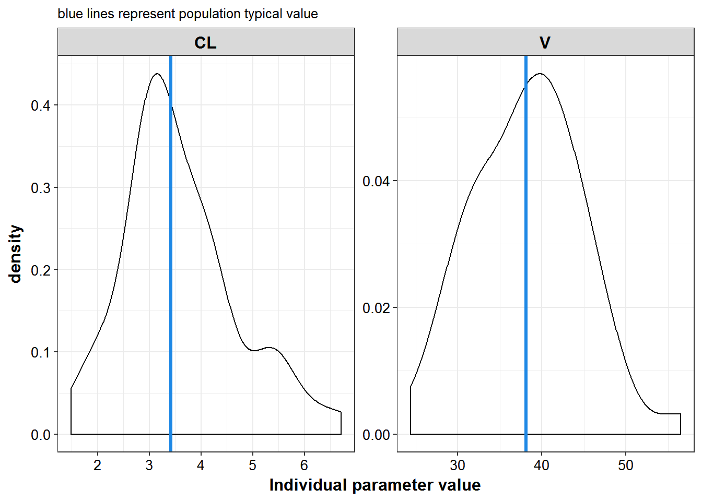
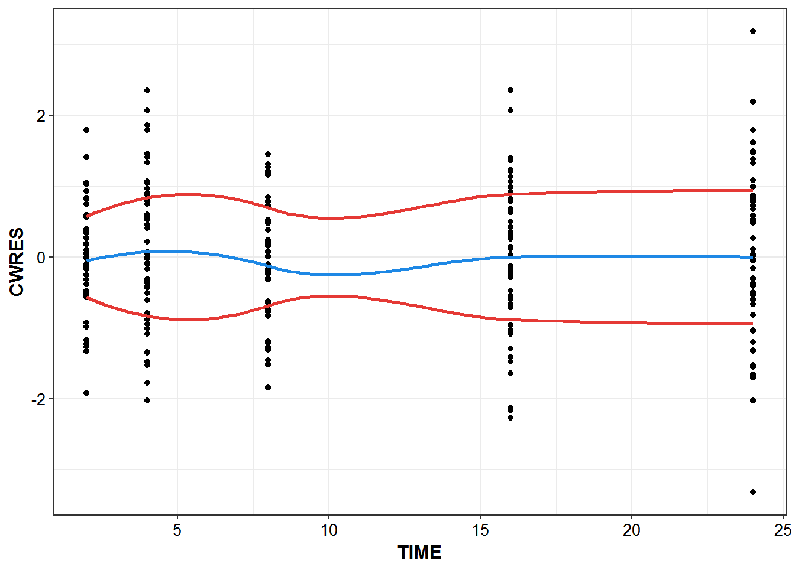
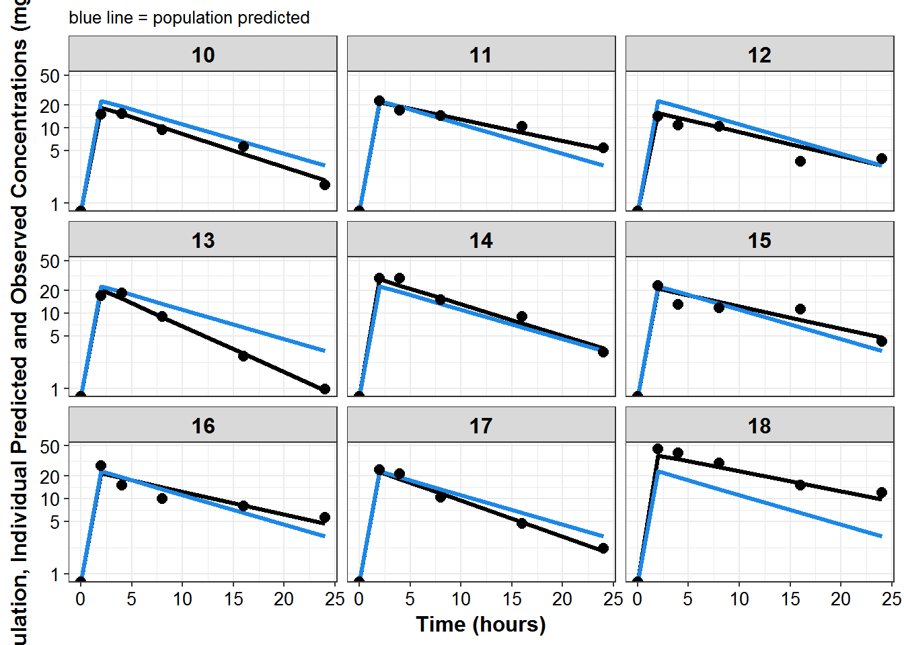
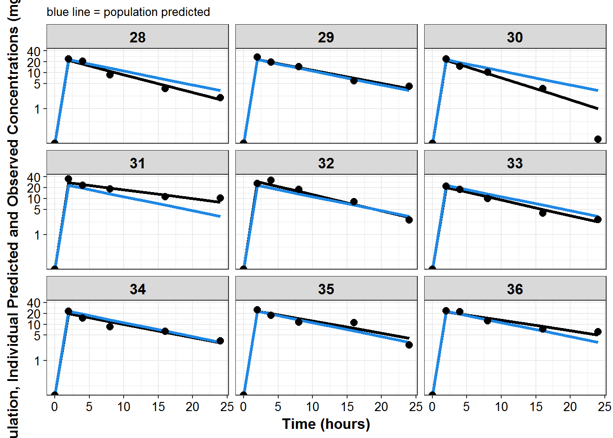

# NONMEM output

## FOCE output


```r
library(knitr)
library(PKPDmisc)
library(tidyverse)
library(decorator)
```


```r
pallete <- Pallete$new("material_design")
mcp <- pallete$colors() 
```


```r
sdtab1 <- read_nonmem("../modeling/sdtab001")
patab1 <- read_nonmem("../modeling/patab001")
```

### Output previews

```r
kable(head(sdtab1))
```


 ID   TIME   IPRED      DV   CWRES    PRED
---  -----  ------  ------  ------  ------
  1      0    0.00    0.00   0.000    0.00
  1      2   24.88   24.96   0.039   22.94
  1      4   21.79   24.87   0.750   19.17
  1      8   16.70   16.14   0.073   13.39
  1     16    9.81   11.03   0.912    6.53
  1     24    5.77    6.33   0.783    3.18

```r
kable(head(patab1))
```


 ID     CL      V   TVCL    TVV      nCL       nV
---  -----  -----  -----  -----  -------  -------
  1   2.42   36.4   3.42   38.1   -0.347   -0.047
  2   2.99   43.2   3.42   38.1   -0.135    0.126
  3   4.20   47.1   3.42   38.1    0.204    0.211
  4   3.50   30.8   3.42   38.1    0.024   -0.213
  5   5.55   45.9   3.42   38.1    0.484    0.185
  6   2.82   38.0   3.42   38.1   -0.195   -0.003

### Visual summaries

#### Parameter values

```r
patab1 %>% 
    select(ID:TVV) %>%
    gather(iparam, value, CL, V) %>%
    mutate(TVP = ifelse(iparam == "CL", TVCL, TVV)) %>%
    ggplot(aes(x = value, group = iparam)) +
    geom_density() +  
    geom_vline(aes(xintercept = TVP), color = mcp$blue, size = 1.2) + 
    facet_wrap(~iparam, scales = "free") + theme_bw() +
    base_theme() +
    labs(x = "Individual parameter value", subtitle="blue lines represent population typical value")
```



#### Individual diagnostic plots


```r
sdtab1 %>%
    filter(TIME >0) %>%
    ggplot(aes(x = TIME, y = CWRES)) + geom_point() +
    geom_smooth(se = FALSE, color = mcp$blue) +
    theme_bw() +
    base_theme() +
    geom_smooth(aes(y = abs(CWRES)), se = F, color = mcp$red) + 
    geom_smooth(aes(y = -abs(CWRES)), se = F, color = mcp$red) 
#> `geom_smooth()` using method = 'loess'
#> `geom_smooth()` using method = 'loess'
#> `geom_smooth()` using method = 'loess'
```




```r
sdtab1 %>%
    ggplot(aes(x = IPRED, y = DV)) + 
    geom_abline(color = mcp$blue, size = 1.1) +
    geom_point() +
    theme_bw() +
    base_theme() +
    labs(x = "Individual Predicted Concentration (mg/L)", 
         y = "Observed Concentration (mg/L)")
```


```r
plot_list <- sdtab1 %>%
    mutate(PNUM = ids_per_plot(ID)) %>%
    split(.$PNUM) %>%
    map(~
    ggplot(., aes(x = TIME, y = IPRED, group = ID)) +
    geom_line(size = 1.1) +
    geom_line(aes(y = PRED), size = 1.1, color = mcp$blue) + 
    geom_point(aes(y = DV), size = 2.5) + facet_wrap(~ID) +
    theme_bw() +
    base_theme() +
    labs(y = "Population, Individual Predicted and Observed Concentrations (mg/L)", 
         x = "Time (hours)",
         subtitle = "blue line = population predicted"
         ) +
    scale_y_log10(breaks = c(1, 5, 10, 20, ceiling(max(.$DV)/10)*10))
    )

print_plots(plot_list)
```















```
#> [[1]]
#> NULL
#> 
#> [[2]]
#> NULL
#> 
#> [[3]]
#> NULL
#> 
#> [[4]]
#> NULL
#> 
#> [[5]]
#> NULL
#> 
#> [[6]]
#> NULL
```


```r
session_details <- devtools::session_info()
session_details$platform
#>  setting  value                       
#>  version  R version 3.3.2 (2016-10-31)
#>  system   x86_64, mingw32             
#>  ui       RTerm                       
#>  language (EN)                        
#>  collate  English_United States.1252  
#>  tz       America/New_York            
#>  date     2016-12-09
knitr::kable(session_details$packages)
```


package      *    version      date         source                             
-----------  ---  -----------  -----------  -----------------------------------
assertthat        0.1          2013-12-06   CRAN (R 3.3.2)                     
backports         1.0.4        2016-10-24   CRAN (R 3.3.2)                     
bookdown          0.2          2016-11-12   CRAN (R 3.3.2)                     
codetools         0.2-15       2016-10-05   CRAN (R 3.3.2)                     
colorspace        1.2-7        2016-10-11   CRAN (R 3.3.2)                     
DBI               0.5-1        2016-09-10   CRAN (R 3.3.2)                     
decorator    *    0.0.1        2016-12-09   local                              
devtools          1.12.0       2016-06-24   CRAN (R 3.3.2)                     
digest            0.6.10       2016-08-02   CRAN (R 3.3.2)                     
dplyr        *    0.5.0        2016-06-24   CRAN (R 3.3.2)                     
evaluate          0.10         2016-10-11   CRAN (R 3.3.2)                     
ggplot2      *    2.1.0.9001   2016-11-07   Github (hadley/ggplot2@70c3d69)    
gtable            0.2.0        2016-02-26   CRAN (R 3.3.2)                     
highr             0.6          2016-05-09   CRAN (R 3.3.2)                     
htmltools         0.3.5        2016-03-21   CRAN (R 3.3.2)                     
httpuv            1.3.3        2015-08-04   CRAN (R 3.3.2)                     
knitr        *    1.15         2016-11-09   CRAN (R 3.3.2)                     
labeling          0.3          2014-08-23   CRAN (R 3.3.2)                     
lazyeval          0.2.0        2016-06-12   CRAN (R 3.3.2)                     
magrittr          1.5          2014-11-22   CRAN (R 3.3.2)                     
memoise           1.0.0        2016-01-29   CRAN (R 3.3.2)                     
mime              0.5          2016-07-07   CRAN (R 3.3.2)                     
miniUI            0.1.1        2016-01-15   CRAN (R 3.3.2)                     
munsell           0.4.3        2016-02-13   CRAN (R 3.3.2)                     
PKPDmisc     *    0.4.4.9000   2016-11-02   Github (dpastoor/PKPDmisc@beae2a6) 
plyr              1.8.4        2016-06-08   CRAN (R 3.3.2)                     
purrr        *    0.2.2        2016-06-18   CRAN (R 3.3.2)                     
R6                2.2.0        2016-10-05   CRAN (R 3.3.2)                     
Rcpp              0.12.8       2016-11-17   CRAN (R 3.3.2)                     
readr        *    1.0.0        2016-08-03   CRAN (R 3.3.2)                     
rmarkdown         1.2          2016-11-21   CRAN (R 3.3.2)                     
rprojroot         1.1          2016-10-29   CRAN (R 3.3.2)                     
scales            0.4.0.9003   2016-11-07   Github (hadley/scales@d58d83a)     
shiny             0.14.2       2016-11-01   CRAN (R 3.3.2)                     
stringi           1.1.2        2016-10-01   CRAN (R 3.3.2)                     
stringr           1.1.0        2016-08-19   CRAN (R 3.3.2)                     
tibble       *    1.2          2016-08-26   CRAN (R 3.3.2)                     
tidyr        *    0.6.0        2016-08-12   CRAN (R 3.3.2)                     
tidyverse    *    1.0.0        2016-09-09   CRAN (R 3.3.2)                     
withr             1.0.2        2016-06-20   CRAN (R 3.3.2)                     
xtable            1.8-2        2016-02-05   CRAN (R 3.3.2)                     
yaml              2.1.13       2014-06-12   CRAN (R 3.3.2)                     
